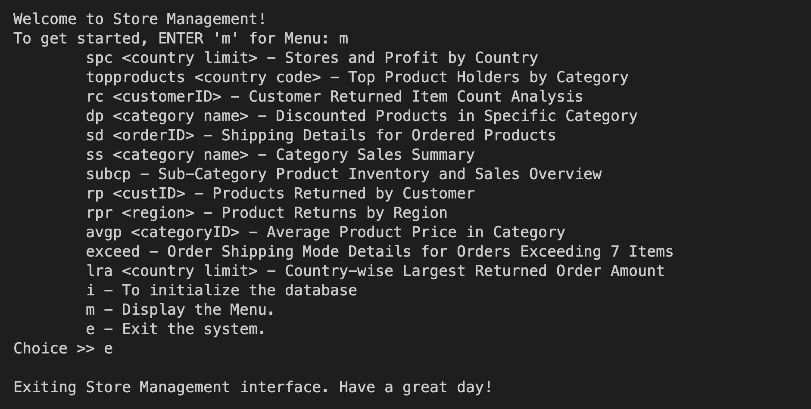
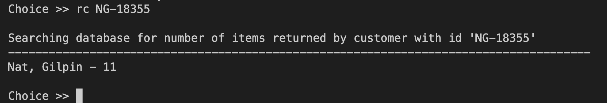
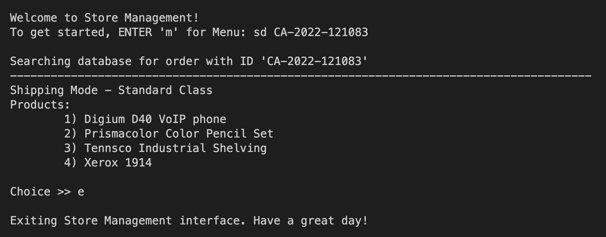

# Introduction
Our database project will use a Java command-line interface (CLI) to implement its interface. The App.java class will serve as the interface's primary entry point. This class will operate as the controller for the interface, coordinating user and database interactions. Another class called Database.java will manage database connectivity and query execution, facilitating interaction with the database.

When App.java is executed, the user will see a menu of options, each of which represents a different operation or query in the database. The command line interface will be used by the user to enter their selection. The chosen query will then be executed by App.java by connecting to the SQLite3 database using the methods supplied by Database.java. The query's outcomes will be obtained and shown to the user in the console.

The command-line interface will include an easy-to-use menu structure that is visually appealing, with each query option labeled for the user deciding on. Guidance through the user's interaction process will be provided by error handling and helpful messaging. The interface will put an emphasis on efficiency and simplicity, giving users a simple way to interact with the database and access the information they need.

# Overview of Interface

## Menu


'Welcome to Store Management!' appears at the top, followed by directions to begin by typing 'm' for the menu. Then, it provides a list of commands such as 'topproducts' for the top product holders by category and 'spc' for stores and profit by country.

## Query 3


The diagram above shows that when rc <customerID> was entered as input, the intended output was displayed, along with the customer's name and the quantity of returned items.

## Query 5


The output of query 5 is shown in the above diagram, which first indicates the orderID it is searching on before listing the order's shipment method and its items in alphabetical order.

# Things required before running the project
Since database used is SQLite, you will need that to be installed in your machine. You can use a terminal-based package manager to download or can download from this [link](https://www.sqlite.org/download.html).

There is one external library used to connect to the database and fetch the queries, which is `mssql-jdbc-11.2.0.jreX`, where X is the java version in your machine. In `lib` directory the library compatible with _java 11_, _java 17_ and _java 18_ is already provided. For any other version here is a [guide](mssql-jdbc-11.2.0.jre11).

By default the Makefile will compile and run the code in __java 18__.

# Running the Interface

Since this is a terminal base interface, you can run this in any terminal. Run the following command in the root directory of the repository to start the application and explore the queries available

```
make run
```

# Cloning repository
To clone this copy the following into terminal:
```
git clone https://github.com/Divy63/Store_Management.git
```
## Cloning in VS code
Open command `Command Palette` by shortcut: `cmd + shift + P` and type `Git clone`
select the first option and paste the following: 
```
https://github.com/Divy63/Store_Management.git
```
# Group Members
[Het Patel](https://github.com/hetu2344)

[Divy Patel](https://github.com/Divy63)

[Vince Ibero](https://github.com/vincewip)
